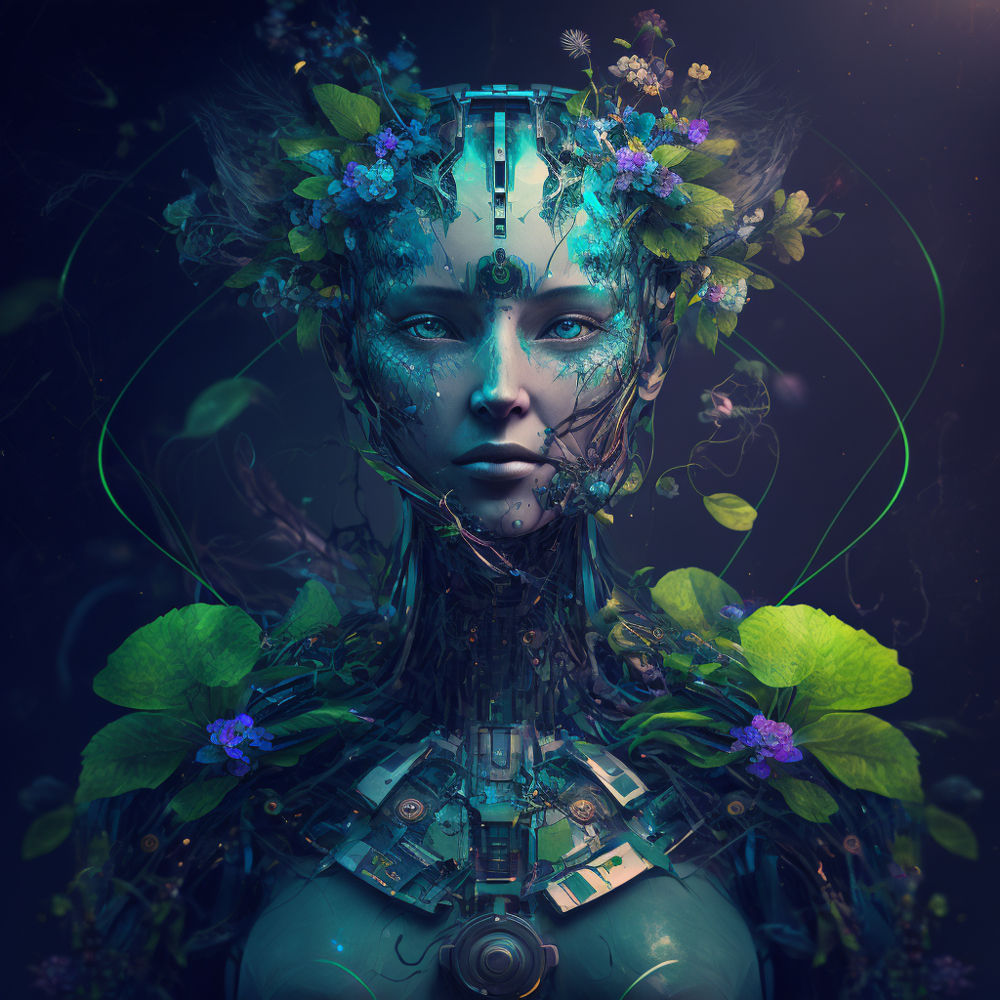
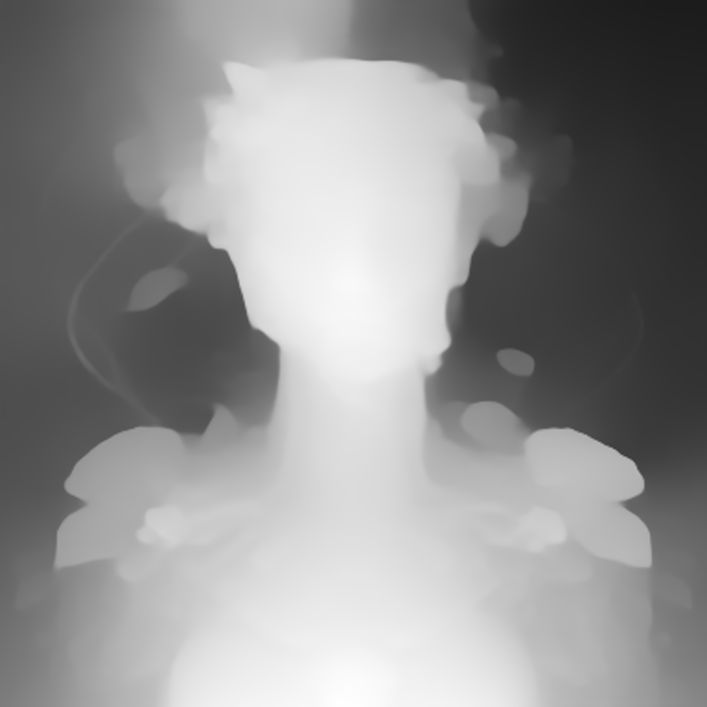

# Art with Depth

A collection of A.I. generated images with depth maps rendered on the web with p5js + glsl vertex shader

## [View the collection](https://pearsonkyle.github.io/Art-with-Depth/)

The images are generated with [MidJourney](https://www.midjourney.com/app/users/364938942497292298/) and use depth maps from https://github.com/isl-org/DPT 

Future improvements could include an upscaling algorithm and view interpolator in shader